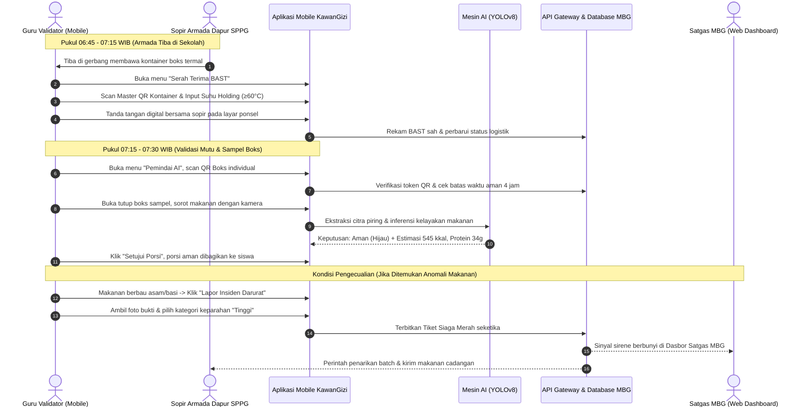

# KAWANGIZI — PANDUAN LENGKAP & CETAK BIRU FITUR APLIKASI MOBILE (GURU & VALIDATOR LAPANGAN)
**Sistem Skrining Kelayakan Konsumsi & Pemindai Makronutrien Berbasis Computer Vision (YOLOv8)**  
*Dokumen Spesifikasi Fungsionalitas & Alur Pengguna Aplikasi Mobile Guru / Validator Sekolah MBG RI*

> **Catatan implementasi saat ini (sinkronisasi backend/web/mobile):** model aktif adalah YOLOv8 classification dari `backend/model_ai/yolov8_cls_best.pt`, dengan kelas `fresh_*` dan `stale_*` untuk buah/sayur. Model ini belum mengenali hidangan matang, gramatur/menu, alergen, benda asing, atau keamanan mikrobiologis; hasilnya adalah skrining visual, bukan sertifikasi keamanan. API scan memeriksa format token QR, belum tanda tangan kriptografis atau kecocokan rute. Makronutrien dihitung server dari nama bahan dan berat yang dikirim ke dataset gizi; foto tidak mengenali bahan. Inferensi lokal/offline belum tersedia. UI web dan mobile mengikuti batas kemampuan ini dan tidak membuat hasil simulasi saat layanan AI gagal.

---

## PENDAHULUAN & PERAN GURU VALIDATOR DALAM EKOSISTEM MBG
Merujuk pada Bab 3.2.1 dan Bab 4.2 [sistem.md](file:///Users/muhfaiizr/Documents/Web%20Project/MBG/sistem.md), **Guru dan Staf Sekolah (Validator Lapangan)** bertindak sebagai **garda terdepan dan benteng pertahanan terakhir** dalam rantai pasok program Makan Bergizi Gratis (MBG). 

Validator berinteraksi secara langsung dengan boks makanan sesaat setelah armada logistik dapur SPPG tiba di gerbang sekolah dan tepat sebelum makanan dibagikan ke meja siswa. Dengan tanggung jawab moral dan hukum untuk melindungi keselamatan anak-anak dari risiko keracunan pangan, validator dibekali **Aplikasi Mobile KawanGizi berbasis React Native & Expo** yang cepat, ringan, responsif, serta dapat beroperasi dalam kondisi internet terbatas (*offline-first*).

---

## TABEL STRUKTUR FITUR & NAVIGASI APLIKASI MOBILE VALIDATOR

| No | Modul Antarmuka Mobile | Rute File Expo Router | Fokus Operasional Validator Sekolah |
|:--:|:-----------------------|:----------------------|:------------------------------------|
| 1 | 🏠 **Beranda & Kuota Sekolah** | `app/(tabs)/index.tsx` | Status Armada Pengantar, Kuota Porsi Hari Ini, HACCP 4-Hour Countdown, & Ringkasan Lolos Uji |
| 2 | 📷 **Pemindai AI & Deteksi Mutu** | `app/(tabs)/scanner.tsx` | Dual-Scanner: Pembacaan QR Kriptografis Boks & Deteksi Kelayakan/Makronutrien AI (YOLOv8) |
| 3 | 📋 **Serah Terima & BAST** | `app/(tabs)/handover.tsx` | Verifikasi Master Container Totes, Pengecekan Suhu Holding (>60°C), & Tanda Tangan BAST Digital |
| 4 | 🚨 **Lapor Insiden Cepat** | `app/(tabs)/incidents.tsx` | Formulir Eskalasi Darurat Makanan Rusak/Basi, Unggah Foto Bukti, & Peringatan Siaga ke Satgas |
| 5 | 📜 **Riwayat & Presensi Makan** | `app/(tabs)/history.tsx` | Rekam Jejak Pindai Harian Per Kelas, Alokasi Porsi Siswa, & Ekspor Rekapitulasi Pembagian |
| 6 | 🔐 **Autentikasi & Akun Sekolah** | `app/auth/login.tsx` | Login NPSN Sekolah, Profil Guru Validator, Kontak Darurat Dapur & Satgas MBG |

---

## 1. 🏠 BERANDA & KUOTA SEKOLAH (`app/(tabs)/index.tsx`)

### A. Latar Belakang & Konteks Sistem
Merujuk Bab 3.2.1 Poin 1 [sistem.md](file:///Users/muhfaiizr/Documents/Web%20Project/MBG/sistem.md), guru validator memerlukan antarmuka ringkas yang langsung menyajikan kepastian operasional saat tiba di sekolah pada pagi hari: apakah armada dapur sedang dalam perjalanan, berapa boks yang harus diterima, dan berapa menit sisa batas waktu aman konsumsi hidangan.

### B. Fungsi Utama (Apa Fungsinya?)
1. **Pelacak Status Armada Logistik Dapur SPPG**:
   * Menampilkan status armada yang mengarah ke sekolah: *Menuju Sekolah*, *Tiba di Gerbang*, atau *Tertunda*.
   * Estimasi Waktu Tiba (ETA) dan nomor polisi kendaraan (misal: *Armada B-9281-KBA · Driver: Bpk. Mulyono · ETA 07:10 WIB*).
   * Tombol panggilan darurat langsung ke sopir armada via WhatsApp / Telepon seluler.
2. **Hitung Mundur Kritis Kelayakan Pangan 4 Jam (*HACCP 4-Hour Countdown*)**:
   * Sinkron otomatis dengan data stempel jam selesai masak dapur SPPG (misal: selesai masak 06:00 WIB → batas konsumsi 10:00 WIB).
   * Menampilkan visual cincin waktu interaktif:
     * 🟢 **Hijau (Aman)**: Sisa waktu > 90 menit.
     * 🟡 **Kuning (Waspada)**: Sisa waktu 30–90 menit (segera instruksikan pembagian ke kelas).
     * 🔴 **Merah (Kritis / Kedaluwarsa)**: Sisa waktu 0 menit (sistem melarang pembagian makanan, tombol scan terkunci otomatis demi mencegah konsumsi makanan basi).
3. **Papan Ringkasan Kuota Porsi Sekolah**:
   * *Target Kuota Porsi Siswa*: Misal 650 Porsi (300 SD Bawah + 350 SD Atas).
   * *Porsi Berhasil Divalidasi*: Real-time counter porsi yang telah lolos sensor AI.
   * *Porsi Ditolak / Rusak*: Jumlah porsi bermasalah yang disisihkan.
   * *Kontainer Master*: Misal 13 Master Totes (@ 50 boks).
4. **Kartu Pintar Menu Hari Ini**:
   * Menampilkan paket menu resmi yang dimasak hari ini (misal: *Paket A — Nasi Ayam Panggang Madu, Tahu Segar, Sayur Brokoli, Pisang, & Susu UHT 125ml*).
   * Rincian alergen penting (misal: *Mengandung laktosa sapi & kedelai*) untuk memperingatkan wali kelas yang memiliki murid dengan riwayat intoleransi makanan.
5. **Tombol Aksi Cepat (*Quick Action Tiles*)**:
   * Tombol *Mulai Scan Boks*, *Serah Terima BAST*, dan *Laporkan Makanan Rusak*.

### C. Aksi Pengguna Guru Validator (Aksinya Ngapain Aja?)
* Memeriksa ETA armada dan memastikan ruang serah terima gerbang sekolah telah siap.
* Meninjau ringkasan menu dan indikasi alergen sebelum boks dibagikan ke ruang kelas.
* Memantau sisa jam aman konsumsi agar jadwal sarapan/makan siang siswa tidak melewati ambang batas biologis HACCP.

---

## 2. 📷 PEMINDAI AI & DETEKSI MUTU (`app/(tabs)/scanner.tsx`)

### A. Latar Belakang & Konteks Sistem
Merujuk Bab 4.2 Poin 1 & 2 [sistem.md](file:///Users/muhfaiizr/Documents/Web%20Project/MBG/sistem.md), instrumen validasi visual KawanGizi mengadopsi algoritma **YOLOv8** yang dioptimalkan untuk perangkat mobile. Fitur ini menggantikan metode inspeksi manual mata telanjang yang rentan kelalaian manusia dengan teknologi skrining proaktif 2 tahap (*dual-stage verification*).

### B. Fungsi Utama (Apa Fungsinya?)
1. **Tahap 1: Pemindai QR Code Digital Kriptografis (Stempel Keaslian Boks)**:
   * Menggunakan lensa kamera untuk membaca QR Code termal 80mm pada tutup boks makanan (`MBG-2026-SPPG01-SDN01P-B01`).
   * Melakukan verifikasi kriptografis instan ke API Gateway:
     * Asal SPPG Dapur Produsen & Nomor Sertifikasi Laik Higiene Sanitasi (SLHS).
     * Kesesuaian Nama Sekolah Tujuan (mencegah salah antar rute boks).
     * Waktu Selesai Masak & Batas Jam Aman Konsumsi.
     * Suhu Masak Inti saat pelepasan dari dapur (wajib ≥ 75°C).
   * Memberikan feedback getar (*haptic feedback*) dan suara *beep* sukses jika QR valid.
2. **Tahap 2: Pemindai Citra Visual Kelayakan Fisik Makanan (AI YOLOv8)**:
   * Validator membuka tutup boks makanan sampel dan mengarahkan kamera ponsel mengikuti bingkai panduan kotak (*viewfinder overlay*).
   * Model Computer Vision mendeteksi anomali fisik pembusukan secara instan:
     * *Daging/Ikan*: Deteksi perubahan warna keabuan/pucat, lendir permukaan, atau bau tengik.
     * *Sayuran*: Deteksi daun layu menghitam, tekstur berlendir, atau perubahan warna kuah menjadi keruh berbusa.
     * *Nasi*: Deteksi perubahan warna kekuningan/titik jamur (*mold spot*) atau tekstur lembek berair.
     * *Benda Asing*: Deteksi rambut, serangga, stapler, kawat cuci piring, serpihan plastik.
3. **Kartu Keputusan Mutu Instan (*Instant Quality Decision Card*)**:
   * 🟢 **LAYAK KONSUMSI (SKOR KEAMANAN ≥ 95%)**: Seluruh komponen hidangan segar, bebas kontaminasi, aman disajikan.
   * 🟡 **PERINGATAN / KONSUMSI SEGERA (SKOR 80–94%)**: Makanan masih layak tetapi suhu boks mendekati batas kritis (misal < 60°C) atau waktu konsumsi tersisa < 45 menit.
   * 🔴 **TIDAK LAYAK KONSUMSI (DITOLAK SISTEM / SKOR < 80%)**: Ditemukan indikasi pembusukan atau benda asing. Aplikasi secara otomatis mengunci boks, membunyikan alarm peringatan, dan memunculkan tombol *Ajukan Penarikan Batch / Lapor Insiden*.
4. **Estimasi Makronutrien Deterministik Visual**:
   * Menampilkan perkiraan kandungan gizi porsi hasil deteksi segmentasi visual piring:
     * *Energi Total*: 545 kkal (dibandingkan dengan batas target AKG Kemenkes kelas terkait).
     * *Protein*: 34 gram.
     * *Karbohidrat*: 68 gram.
     * *Lemak Sehat*: 14 gram.
     * *Serat Pangan*: 6.2 gram.
5. **Mode Offline-First (*Local On-Device Inference*)**:
   * Jika sinyal internet sekolah terputus (*blank spot*), aplikasi tetap dapat memvalidasi QR secara offline menggunakan tanda tangan digital lokal (*offline public key*) dan menyimpan riwayat pindaian di cache lokal ponsel (*AsyncStorage/SQLite*), yang otomatis disinkronkan ke server pusat saat internet kembali terhubung.

### C. Aksi Pengguna Guru Validator (Aksinya Ngapain Aja?)
* Memilih metode validasi: *Pindai QR Label Boks* atau *Inspeksi Visual Porsi AI*.
* Mengarahkan kamera ponsel ke arah boks makanan hingga garis panduan berubah menjadi hijau.
* Meninjau hasil kartu keputusan mutu dan makronutrien.
* Mengklik tombol *Setujui Porsi (Lolos Uji)* atau tombol *Tolak & Amankan Sampel (Bermasalah)*.

---

## 3. 📋 SERAH TERIMA & BAST DIGITAL (`app/(tabs)/handover.tsx`)

### A. Latar Belakang & Konteks Sistem
Merujuk Bab 4.2 Poin 4 [sistem.md](file:///Users/muhfaiizr/Documents/Web%20Project/MBG/sistem.md) dan [SPPG.md](file:///Users/muhfaiizr/Documents/Web%20Project/MBG/SPPG.md) Bab 7, proses serah terima makanan antara sopir armada dapur SPPG dan guru sekolah wajib dibuktikan dengan dokumen resmi berkekuatan hukum demi mencegah manipulasi jumlah porsi dan mengunci pertanggungjawaban legal.

### B. Fungsi Utama (Apa Fungsinya?)
1. **Pindai Master QR Kontainer Termal (*Master Tote Acceptance*)**:
   * Setiap 1 kontainer boks termal besar berisi 50 porsi makanan memiliki 1 Master QR Code.
   * Guru validator cukup memindai Master QR kontainer (misal: 13 kali scan untuk 650 porsi), tanpa harus memindai 650 boks kecil satu per satu di gerbang sekolah.
2. **Pencatatan Suhu Fisik Penerimaan (*Food Holding Temperature Acceptance*)**:
   * Validator memasukkan angka suhu termometer boks termal saat serah terima (standar keamanan minimal **≥ 60°C** untuk hidangan hangat, dan **4°C – 8°C** untuk susu UHT/buah dingin).
   * Validasi otomatis: jika suhu termal boks < 55°C (masuk zona bahaya *Temperature Danger Zone*), sistem memberikan notifikasi bahwa makanan berisiko dingin dan wajib segera diuji organoleptik.
3. **Rekonsiliasi Kuota Porsi Aktual**:
   * Menghitung selisih antara porsi pesanan dan porsi riil yang diturunkan dari mobil boks:
     * Kuota Sekolah: 650 Porsi.
     * Diterima Utuh: 650 Porsi.
     * Kemasan Bocor / Rusak Fisik: 0 Porsi.
4. **Lembar Tanda Tangan Digital BAST (Berita Acara Serah Terima)**:
   * Kanvas tanda tangan digital langsung pada layar ponsel bagi:
     * *Pihak Pertama (Sopir / Petugas Pengantar SPPG)*.
     * *Pihak Kedua (Guru Validator / PIC Sekolah)*.
   * Nomor Registrasi BAST Otomatis (misal: `BAST/MBG-JKT/20260930/SDN01P-042`).
   * Tombol *Terbitkan & Kirim Salinan BAST* langsung ke sistem SPPG Dapur dan Satgas MBG.

### C. Aksi Pengguna Guru Validator (Aksinya Ngapain Aja?)
* Menyambut sopir armada di gerbang sekolah pukul 06:45 – 07:15 WIB.
* Memindai Master QR kontainer boks termal yang diturunkan.
* Mengukur suhu holding boks dan memasukkan angka derajat Celcius ke aplikasi.
* Membubuhkan tanda tangan digital bersama sopir pada layar ponsel untuk menyelesaikan BAST resmi.

---

## 4. 🚨 LAPOR INSIDEN CEPAT (`app/(tabs)/incidents.tsx`)

### A. Latar Belakang & Konteks Sistem
Merujuk Bab 4.2 Poin 3 [sistem.md](file:///Users/muhfaiizr/Documents/Web%20Project/MBG/sistem.md) dan [SUPERADMIN.md](file:///Users/muhfaiizr/Documents/Web%20Project/MBG/SUPERADMIN.md) Bab 4, jika ditemukan tanda-tanda makanan basi, berbau asam, berbusa, atau terjadi reaksi mual pada siswa, guru validator membutuhkan instrumen eskalasi darurat berkecepatan tinggi (*fast-track panic button*) agar Satgas MBG pusat dapat segera menghentikan distribusi batch makanan tersebut di sekolah-sekolah lain.

### B. Fungsi Utama (Apa Fungsinya?)
1. **Kategori Pilihan Insiden Terstruktur**:
   * *Aroma Asam / Basi*: Makanan mengeluarkan bau menyengat atau berbusa.
   * *Benda Asing*: Ditemukan serangga, rambut, kawat cuci piring, serpihan plastik, krikil.
   * *Kematangan Tidak Sempurna*: Daging ayam masih berdarah/mentah di bagian dalam.
   * *Suhu Drop & Basi Logistik*: Suhu boks dingin saat tiba di sekolah (< 50°C).
   * *Kemasan Pecah / Bocor*: Segel terbuka dan makanan tumpah tercemar debu jalan.
   * *Reaksi Alergi / Siswa Mengeluh Sakit*: Siswa mengeluh gatal, pusing, mual pasca mencicipi.
2. **Kamera Pengambilan Bukti Visual Digital**:
   * Validator dapat mengambil 1 hingga 3 foto bukti resolusi tinggi langsung dari aplikasi.
   * Foto secara otomatis dibubuhi *watermark digital* stempel tanggal, waktu, koordinat GPS sekolah, dan ID batch makanan untuk mencegah manipulasi bukti.
3. **Penentuan Derajat Keparahan (*Severity Level*)**:
   * 🟡 **Rendah (Porsi Terisolasi / Kemasan Pecah)**: Cukup disisihkan 1-2 boks dan diganti porsi cadangan sekolah.
   * 🟠 **Sedang (Kekurangan Porsi / Keterlambatan Pengiriman > 30 Menit)**.
   * 🔴 **Tinggi / Darurat Merah (Kontaminasi Sistemik / Bau Basi Massal)**: Memicu notifikasi *Push Siren* berbunyi nyaring di dasbor Satgas MBG dan Manajer Dapur SPPG, memerintahkan isolasi seluruh boks makanan di sekolah.
4. **Instruksi Protokol Tindakan Pertama bagi Guru**:
   * Menampilkan panduan langkah darurat yang harus diambil guru saat insiden terjadi:
     * *Langkah 1*: Amankan dan pisahkan boks bermasalah dari jangkauan anak-anak.
     * *Langkah 2*: Masukkan 1 sampel ke dalam plastik steril untuk uji laboratorium.
     * *Langkah 3*: Berikan air putih matang kepada siswa jika sempat mencicipi dan bawa ke ruang UKS.
5. **Pelacak Status Tiket Insiden Real-Time**:
   * Menampilkan perkembangan penanganan aduan oleh Satgas MBG: *Terkirim*, *Sedang Diinvestigasi Tim Medis*, *Pasokan Pengganti Sedang Dikirim*, hingga *Selesai*.

### C. Aksi Pengguna Guru Validator (Aksinya Ngapain Aja?)
* Membuka form insiden saat mendeteksi kejanggalan pada makanan.
* Memilih kategori masalah dan menjepret foto bukti kondisi makanan.
* Menekan tombol *Kirim Laporan Siaga ke Satgas MBG*.
* Mengikuti instruksi isolasi makanan di ruang aman sekolah.

---

## 5. 📜 RIWAYAT & PRESENSI MAKAN (`app/(tabs)/history.tsx`)

### A. Latar Belakang & Konteks Sistem
Merujuk Bab 4.2 Poin 4 [sistem.md](file:///Users/muhfaiizr/Documents/Web%20Project/MBG/sistem.md), guru memerlukan buku catatan digital untuk merekonsiliasi jumlah porsi yang lolos uji dengan kehadiran fisik siswa di masing-masing kelas (Kelas 1 s/d Kelas 6 SD, atau Kelas 7 s/d 9 SMP) untuk memastikan tidak ada porsi mubazir dan seluruh siswa menerima hak makannya secara merata.

### B. Fungsi Utama (Apa Fungsinya?)
1. **Buku Log Riwayat Pindaian Harian**:
   * Daftar seluruh boks makanan yang telah dipindai hari ini, tersusun kronologis berdasarkan jam pemindaian (misal: 07:05, 07:12, 07:18 WIB).
   * Status tiap porsi: *Lolos Verifikasi (Hijau)* atau *Ditolak / Rusak (Merah)*.
2. **Papan Rekonsiliasi Distribusi Kelas**:
   * Menampilkan rekapitulasi distribusi makanan per kelas:
     * *Kelas 1A*: Kuota 28 Siswa · Hadir 27 · Sakit 1 · Porsi Diserahkan 27 · Porsi Sisa 1.
     * *Kelas 1B*: Kuota 30 Siswa · Hadir 30 · Porsi Diserahkan 30 · Porsi Sisa 0.
     * *Kelas 2A*: Kuota 29 Siswa · Hadir 29 · Porsi Diserahkan 29 · Porsi Sisa 0.
3. **Pengelolaan Porsi Sisa Berlebih (*Surplus Food Management*)**:
   * Mencatat porsi makanan aman yang tersisa akibat ada siswa tidak masuk sekolah.
   * Opsi alokasi resmi sesuai regulasi BGN: Diserahkan kepada staf kebersihan/penjaga sekolah, atau disimpan sesuai SOP untuk program makanan tambahan sore hari.
4. **Filter & Pencarian Riwayat**:
   * Memfilter riwayat berdasarkan tanggal (kemarin, 7 hari lalu, bulan ini).
   * Mencari nomor batch boks tertentu jika di kemudian hari ada pertanyaan dari orang tua siswa atau dinas kesehatan.
5. **Ekspor Laporan Harian Sekolah**:
   * Menghasilkan ringkasan laporan berformat PDF / lembar sebar untuk arsip berkas sekolah dan tembusan ke Komite Sekolah.

### C. Aksi Pengguna Guru Validator (Aksinya Ngapain Aja?)
* Memeriksa kesesuaian jumlah porsi yang dibagikan dengan buku presensi kelas masing-masing.
* Menginput data siswa tidak hadir agar porsi sisa tercatat resmi dan tidak disalahgunakan.
* Mengunduh rekapitulasi harian sekolah sebagai dokumen pertanggungjawaban kepala sekolah.

---

## 6. 🔐 AUTENTIKASI & AKUN SEKOLAH (`app/auth/login.tsx`)

### A. Latar Belakang & Konteks Sistem
Aplikasi mobile hanya boleh dioperasikan oleh guru atau tenaga kependidikan resmi yang telah ditunjuk oleh Kepala Sekolah dan terdaftar di data pokok pendidikan (Dapodik / Satgas MBG) guna mencegah akses ilegal terhadap penerbitan BAST dan pelaporan data palsu.

### B. Fungsi Utama (Apa Fungsinya?)
1. **Login Kredensial Validator Sekolah**:
   * Menggunakan Nomor Pokok Sekolah Nasional (NPSN) dan Kode Akses Keamanan Validator Terverifikasi.
   * Dukungan otentikasi biometrik (*Fingerprint / Face ID*) untuk login cepat di pagi hari tanpa harus mengetik kata sandi ulang.
2. **Profil Validator & Informasi Sekolah**:
   * Nama Lengkap Guru / Validator (misal: *Ibu Siti Aminah, S.Pd. — NIP 198504...*).
   * Nama Sekolah Binaan (misal: *SDN Menteng 01 Pagi, Jakarta Pusat*).
   * Identitas Dapur SPPG Rekanan (misal: *SPPG 01 Menteng Jaya Mandiri*).
3. **Buku Kontak Cepat Satgas & Dapur (*Emergency Contacts*)**:
   * Tombol panggilan darurat ke Call Center Satgas MBG Wilayah (24 Jam).
   * Nomor WhatsApp Kepala Dapur SPPG binaan.
   * Nomor Puskesmas / RSUD rujukan terdekat untuk penanganan gawat darurat medis.
4. **Penyimpanan Berkas Offline & Sinkronisasi Data**:
   * Indikator status koneksi internet: 🟢 *Online (Tersinkron)* atau 🟡 *Offline (Tersimpan Lokal)*.
   * Tombol *Sinkronkan Data Tertunda* saat ponsel kembali mendapatkan akses sinyal internet stabil.

---

## RINGKASAN ALUR PENGGUNA HARIAN (DAILY USER JOURNEY GURU VALIDATOR)

---

*Dokumen ini merupakan spesifikasi acuan resmi untuk pengembangan antarmuka, arsitektur data, dan integrasi API aplikasi mobile KawanGizi pada platform React Native / Expo.*
